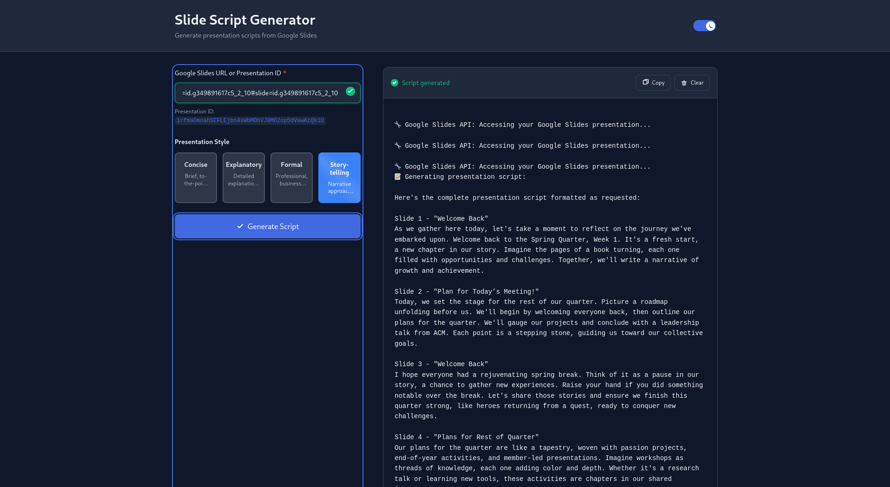

# Slide Agent

An AI-powered presentation script generator that transforms Google Slides presentations into natural, flowing narration scripts. Built with modern TypeScript frameworks and real-time streaming capabilities.

**Project Origin**: This project was inspired by an AI agents book I picked up after attending CascadiaJS 2026. The conference provided incredible insights into client-side AI, frontend/AI best practices, and the latest tools from the people building them. The welcoming Pacific Northwest dev community and their knowledge sharing motivated me to explore practical AI agent implementations using mastra. 



## How It Works

The system operates through a sophisticated agent workflow:

1. **Input Processing**: Users provide a Google Slides presentation ID or URL through a modern web interface
2. **OAuth Authentication**: Secure integration with Google Slides API using OAuth 2.0 credentials
3. **Slide Analysis**: The AI agent systematically retrieves each slide's content and metadata
4. **Script Generation**: GPT-3.5-turbo processes the slide content to create natural presentation scripts
5. **Real-time Streaming**: Generated content streams to the frontend using Server-Sent Events

The agent follows a structured workflow: first determining slide count, then iterating through each slide to extract content, and finally generating cohesive presentation scripts with smooth transitions between slides.

## Architecture

### Backend (Mastra Framework)
- **Mastra Core**: TypeScript-first agent framework for building AI applications
- **Agent System**: Declarative agent configuration with built-in tool integration
- **Google Slides Tools**: Custom tools for OAuth-authenticated API interactions
- **Memory Management**: Conversation threading and context preservation
- **Streaming Engine**: Real-time response streaming with VNext compatibility

### Frontend (Next.js)
- **Next.js 14**: React framework with App Router and server-side streaming
- **TypeScript**: Full type safety across components and API routes
- **Server-Sent Events**: Real-time streaming communication protocol
- **Component Architecture**: Modular React components with proper separation of concerns
- **Storybook Integration**: Component development and testing environment

### Key Technologies
- **AI SDK**: OpenAI integration with V2 model compatibility
- **Google APIs**: Official Google Slides API client with OAuth 2.0
- **Zod**: Runtime schema validation and type inference
- **Modern CSS**: Custom properties for theming with dark/light mode support

## Project Structure

```
slide-agent/
├── mastra/                 # Mastra agent configuration
│   ├── agents/            # AI agent definitions
│   ├── tools/             # Google Slides API tools
│   └── index.ts          # Main Mastra instance
├── frontend/              # Next.js web application
│   ├── app/              # App Router pages and API routes
│   ├── components/       # React components
│   └── lib/              # Utility functions
└── credentials.json      # Google OAuth credentials
```

## Setup

1. **Install Dependencies**
```bash
npm install
cd frontend && npm install
```

2. **Google OAuth Setup**
- Create a Google Cloud Console project
- Enable Google Slides API
- Create OAuth 2.0 desktop credentials
- Save as `credentials.json` in project root

3. **Environment Variables**
```bash
# .env
OPENAI_API_KEY=your_openai_api_key
```

4. **Development**
```bash
# Terminal 1: Start Mastra backend
npm run dev

# Terminal 2: Start Next.js frontend
cd frontend && npm run dev
```

The application runs on `localhost:3000` with the Mastra API on `localhost:4111`.

## Features

- **Real-time Streaming**: Progressive script generation with live updates
- **Google Slides Integration**: Direct OAuth-authenticated access to presentations
- **Natural Language Processing**: Context-aware script generation with smooth transitions
- **Modern UI**: Royal blue themed interface with responsive design
- **Component Testing**: Storybook integration for component development
- **Type Safety**: Full TypeScript implementation across the stack

## Usage

Enter a Google Slides URL or presentation ID into the web interface. The system will authenticate with Google, analyze the presentation structure, and generate a complete narration script in real-time. The generated script includes natural transitions, proper slide formatting, and presenter-friendly language.